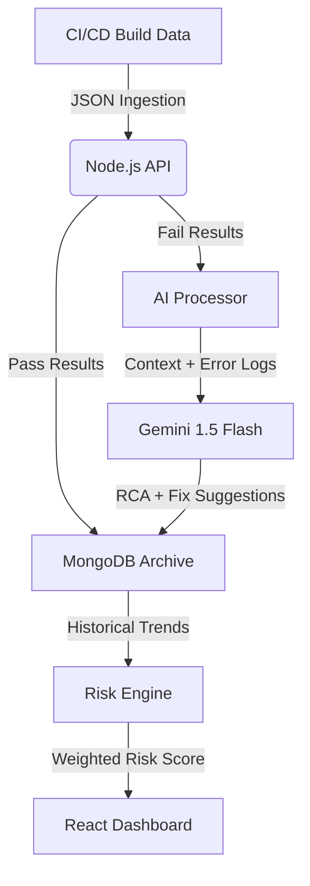

# QA Insights Hub 🧠

> **Predict where your next bug will appear—before it breaks production.**

QA Insights Hub is a **smart test analytics platform** that transforms raw test execution data into actionable intelligence. By combining historical release patterns with LLM-based root cause analysis, it allows engineering teams to move from *reactive* bug fixing to *predictive* quality assurance.

*(Place screenshot of your main dashboard here)*

---

##  The Problem vs. The Solution

**Traditional QA** is retrospective. Dashboards show you pass/fail metrics after the build is done.
**QA Insights Hub** is predictive. It answers three critical questions:

1. Which features are trending toward failure?
2. Why did this specific test fail (Root Cause Analysis)?
3. Do we need a full regression, or can we target specific modules?

---

##  System Architecture & Workflow

The system operates on a pipeline designed for high-throughput build analysis:



### Core Principles

1. ** Intelligent Failure Analysis (RCA)**
When a test fails, the system sends the script context and error trace to the **Gemini AI Engine**. It understands the build structure and returns:
* Natural language explanation of the error.
* Specific code fix recommendations.
* *Optimization:* Passing tests skip this step to reduce API latency and cost.


2. ** Mathematical Risk Prediction**
We don't guess; we calculate. Every feature is assigned a **Risk Score (0-100%)**.
* **Logic:** Weighted Moving Average across the last `N=5` builds.
* **Weighting:** Recent builds carry higher coefficients (), ensuring the score reflects current stability while acknowledging historical flakiness.
* **Outcome:** Recommendations for `Full Retest`, `Partial Retest`, or `No Retest`.


3. ** Historical Memory**
A hierarchical archive (Build  Module  Feature  Test Case) provides full visibility into regression patterns over time.

---

## 🛠 Tech Stack

Built for performance, scalability, and maintainability.

| Category | Technology | Purpose |
| --- | --- | --- |
| **Frontend** | React + Vite | High-performance SPA rendering. |
| **Styling** | Tailwind + Shadcn UI | Enterprise-grade, accessible UI components. |
| **Visualization** | Recharts | Rendering complex risk trend lines and heatmaps. |
| **Backend** | Node.js + Express | RESTful API orchestration. |
| **Database** | MongoDB | Flexible schema for hierarchical build/test data. |
| **AI Engine** | Google Gemini 1.5 | Contextual analysis and code-level debugging. |

---

## ⚡ Getting Started

### Prerequisites

* Node.js v18+
* MongoDB (Local or Atlas)
* Google Gemini API Key

### Installation

1. **Clone the repository**
```bash
git clone https://github.com/yourusername/qa-insights-hub.git
cd qa-insights-hub

```


2. **Backend Setup**
```bash
cd server
npm install

```


Create a `.env` file in the `/server` directory:
```env
PORT=5000
MONGO_URI=mongodb://localhost:27017/qa-insights
GEMINI_API_KEY=your_google_api_key_here

```


Start the server:
```bash
npm run dev

```


3. **Frontend Setup**
```bash
# In a new terminal
cd client
npm install
npm run dev

```


4. **Access the Dashboard**
Navigate to `http://localhost:5173` (or your configured Vite port).

###  Demo Data!!!

To see the predictive engine in action without connecting a live CI pipeline:

1. Click **"Upload Demo Data"** on the dashboard.
2. This simulates a 5-build release cycle with varying failure rates.
3. Navigate to **"Feature Risk"** to see the weighted algorithms calculate failure probabilities.

---

##  Roadmap

* [ ] **JIRA Integration:** Auto-create bug tickets with AI-generated descriptions.
* [ ] **CI/CD Hooks:** Native plugins for Jenkins and GitHub Actions.
* [ ] **Custom Weighting:** Allow teams to configure the "Risk Sensitivity" algorithm.
* [ ] **Slack/Teams Alerts:** Real-time notification of "High Risk" features during builds.

---

## 🤝 Contributing

This is a tool built to solve real-world QA bottlenecks. Contributions are welcome!

1. Fork the Project
2. Create your Feature Branch (`git checkout -b feature/AmazingFeature`)
3. Commit your Changes (`git commit -m 'Add some AmazingFeature'`)
4. Push to the Branch (`git push origin feature/AmazingFeature`)
5. Open a Pull Request

---

<p align="center">
Built with ❤️ by [Your Name]
</p>
